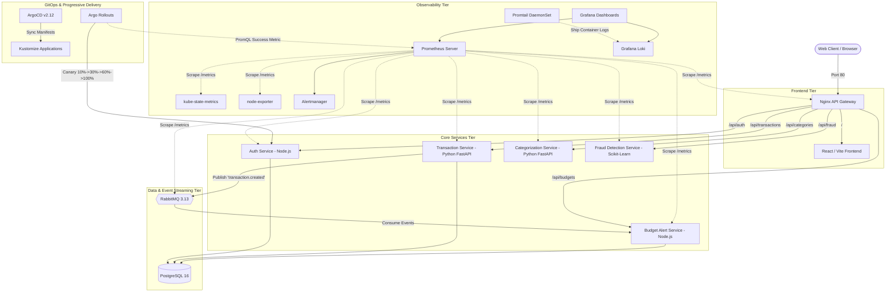

# FinGuard: Enterprise Microservices Platform & DevOps Showcase

[](https://kubernetes.io/)
[](https://argo-cd.readthedocs.io/)
[](https://argoproj.github.io/argo-rollouts/)
[](https://prometheus.io/)
[](https://grafana.com/)
[](https://trivy.dev/)
[](https://pytest.org/)

FinGuard is a production-grade, containerized microservices financial platform with real-time transaction processing, automated categorization, budgeting alerts, and experimental machine learning fraud detection.

Engineered to high-standard DevOps, SRE, and Cloud-Native specifications, FinGuard showcases **GitOps continuous delivery (ArgoCD)**, **progressive canary deployments (Argo Rollouts)**, **full-stack observability (Prometheus/Grafana/Loki/Alertmanager)**, **dynamic autoscaling (HPA v2)**, **zero-trust microsegmentation (NetworkPolicies)**, and **automated disaster recovery**.

---

> [!WARNING]
> **EXPERIMENTAL ANOMALY DETECTION NOTICE**  
> The anomaly scores and fraud alert badges in this platform are generated by an experimental `scikit-learn` Isolation Forest model and financial heuristics for demonstration and developer prototyping purposes. They are **not** certified, validated, or suitable for making real-world financial, credit, or payment authorization decisions.

---

## 1. Platform Architecture

The system operates as an event-driven microservices architecture fronted by an Nginx API Gateway with strict decoupling, database-per-service isolation, asynchronous messaging, and complete observability.



---

## 2. Microservices Breakdown

| Service | Technology Stack | Port | Responsibilities |
|---|---|---|---|
| **API Gateway** | Nginx Alpine (Patched) | `80` (Cluster) / `8080` (Host) | Reverse proxy, security headers, CORS, rate-limiting readiness, and routing. |
| **Frontend** | React 18, Vite, Modern CSS | `80` (Internal) | Dark fintech dashboard, SVG charts, transaction & budget management. |
| **Auth Service** | Node.js, Express, `bcryptjs`, `jsonwebtoken` | `5001` | Password hashing, JWT signing/verification, Argo Rollout canary target. |
| **Transaction Service** | Python 3.11, FastAPI, SQLAlchemy | `5002` | Transaction CRUD, categorization coordination, RabbitMQ event publishing, HPA target. |
| **Categorization Service** | Python 3.11, FastAPI, Regex Rules | `5003` | Automated transaction categorization into 9 spending categories. |
| **Fraud Detection Service** | Python 3.11, FastAPI, `scikit-learn` | `5004` | Unsupervised Isolation Forest model + heuristics for anomalous spending. |
| **Budget & Alert Service** | Node.js, Express, `amqplib`, `pg` | `5005` | Monthly category allowances, idempotent RabbitMQ event consumption, threshold alerts. |
| **Message Broker** | RabbitMQ 3.13 Management | `5672`, `15672`, `15692` | Persistent topic exchange `finguard.events`, dead-letter exchange, Prometheus metrics. |
| **Database** | PostgreSQL 16 Alpine | `5432` | Isolated microservice databases (`finguard_auth`, `finguard_transactions`, `finguard_budgets`). |

---

## 3. DevOps, SRE & Cloud-Native Engineering Highlights

- **GitOps Continuous Delivery:** Managed declaratively via **ArgoCD v2.12.0** syncing from Git (`finguard-app` and `finguard-monitoring-app`), with out-of-band secret separation.
- **Progressive Canary Delivery:** **Argo Rollouts** manages `auth-service` with automated 4-step canary rollout (`10% -> 30% -> 60% -> 100%`), integrated **Prometheus AnalysisRuns** (validating `http_requests_total` success rate >= 95%), and automated rollback.
- **Dynamic Autoscaling:** Configured **HorizontalPodAutoscaler (HPA v2)** and Metrics Server across 5 stateless services; sustained **~55.2 req/s** with zero errors, automatically scaling `transaction-service` 1 -> 3 -> 5 pods.
- **Zero-Trust Network Microsegmentation:** Applied 11 Kubernetes **NetworkPolicy** manifests enforcing default deny-all ingress, restricted DNS egress, and explicit cross-service allowlists.
- **Strict Security & Vulnerability Gates:** Remediated **CVE-2026-93990** (`libexpat 2.8.5-r0`), achieving **0 HIGH / 0 CRITICAL CVEs** in Aqua Security Trivy container scans with `exit-code: 1` gates.
- **Disaster Recovery & High Availability:** Automated PowerShell backup/restore scripts (`scripts/backup-postgres.ps1`, `restore-postgres.ps1`) with SHA256 validation; benchmarked platform **MTTR of 12.1 seconds** with 100% data fidelity.
- **Comprehensive Observability:** **Prometheus** (14 targets `UP`), **Alertmanager** (10 production alerting rules), **Grafana** (3 auto-provisioned dashboards), and **Loki + Promtail** container log aggregation.

---

## 4. Quick Start & Setup Guides

### Option A: Local Docker Compose (Fastest for Development)

```powershell
# 1. Navigate to directory & setup env
Copy-Item .env.example .env

# 2. Start all 10 containers
docker compose up -d --build

# 3. Verify health
docker compose ps
```

Access URLs:
- FinGuard Dashboard: [http://localhost:8080](http://localhost:8080)
- RabbitMQ Console: [http://localhost:15672](http://localhost:15672) (`finguard_rabbit` / `finguard_rabbit_secret`)

---

### Option B: Production Kubernetes (Minikube)

#### 1. Start Minikube & Enable Metrics Server
```powershell
minikube start --driver=docker
minikube addons enable metrics-server
```

#### 2. Create Namespaces & Apply Secrets (Out-of-Band)
```powershell
kubectl apply -f k8s/00-namespace.yaml
Copy-Item k8s/02-secrets.yaml.example k8s/02-secrets.yaml
# Edit k8s/02-secrets.yaml with secure credentials, then apply:
kubectl apply -f k8s/02-secrets.yaml
```

#### 3. Deploy Platform Manifests via Kustomize
```powershell
kubectl apply -k k8s
kubectl apply -k k8s/monitoring
```

#### 4. Access Platform & Dashboards
```powershell
# API Gateway (http://localhost:8081)
kubectl port-forward svc/api-gateway -n finguard 8081:80

# Grafana Dashboards (http://localhost:3000, Login: admin / admin)
kubectl port-forward svc/grafana -n monitoring 3000:3000

# Prometheus Browser (http://localhost:9090)
kubectl port-forward svc/prometheus -n monitoring 9090:9090

# ArgoCD Management UI (https://localhost:8082, Login: admin / initial secret)
kubectl port-forward svc/argocd-server -n argocd 8082:443
```

---

## 5. Operations & SRE Runbooks

### 5.1 Canary Rollout Execution & Verification
To trigger an automated 4-stage canary deployment of `auth-service`:
```powershell
# Update image tag on Rollout
kubectl patch rollout auth-service -n finguard --type='json' `
  -p='[{"op": "replace", "path": "/spec/template/spec/containers/0/image", "value": "finguard-auth-service:v1.0.1"}]'

# Watch rollout progression and Prometheus AnalysisRuns
kubectl get rollout auth-service -n finguard -w
kubectl get analysisrun -n finguard
```

### 5.2 Load Testing & HPA Verification
To simulate concurrent traffic and observe horizontal pod autoscaling:
```powershell
# Run multithreaded load generator (16 workers, ~55 req/s)
python tests/load_test_hpa.py

# Observe HPA and replica scaling in real time
kubectl get hpa -n finguard -w
```

### 5.3 PostgreSQL Backup & Disaster Recovery Drill
```powershell
# Run full timestamped cluster & database backup
powershell -ExecutionPolicy Bypass -File .\scripts\backup-postgres.ps1

# Run non-destructive restore drill into isolated test database
powershell -ExecutionPolicy Bypass -File .\scripts\restore-postgres.ps1 `
  -BackupFile "backups\postgres_YYYYMMDD_HHMMSS\finguard_transactions.sql" `
  -TargetDatabase "finguard_restore_test" -Cleanup
```

### 5.4 Running Complete Verification Tests
```powershell
# 1. End-to-End multi-service integration test
$env:GATEWAY_URL="http://localhost:8081"
python tests/e2e_test.py

# 2. Container security scans with Trivy
docker run --rm -v //var/run/docker.sock:/var/run/docker.sock aquasec/trivy:latest image `
  --severity HIGH,CRITICAL --ignore-unfixed --exit-code 1 finguard-frontend:latest
```

---

## 6. Project Documentation & Audit Reports

For comprehensive technical deep-dives, benchmark data, and telemetry logs, refer to the reports library:

- 📊 **[Master DevOps Completion Report](file:///reports/MASTER_DEVOPS_COMPLETION_REPORT.md)** — Comprehensive review of all 10 project milestones.
- 🧪 **[Final Test Results & QA](file:///reports/FINAL_TEST_RESULTS.md)** — Unit, integration, E2E, load, and canary test outputs.
- 🛡️ **[Security Scan & Hardening Report](file:///reports/SECURITY_SCAN_SUMMARY.md)** — Trivy vulnerability analysis, CVE-2026-93990 remediation, and NetworkPolicies.
- 🔄 **[Disaster Recovery & High Availability Report](file:///reports/DISASTER_RECOVERY_REPORT.md)** — Backup/restore drill data, PVC configuration, and MTTR benchmarks.
- 📈 **[DevOps Progress Tracking](file:///reports/MASTER_DEVOPS_PROGRESS.md)** — Chronological milestone log with 100% completion verification.
