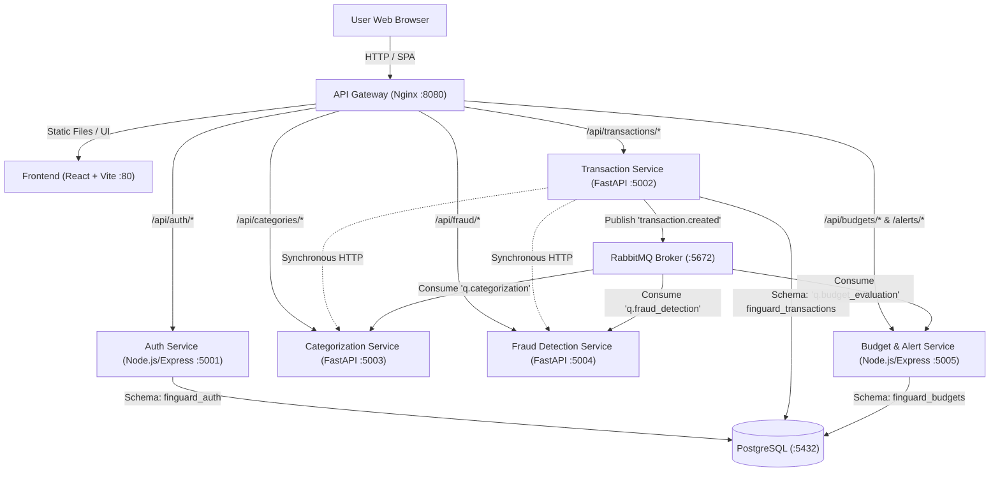

# FinGuard: Personal Finance & Fraud Detection Platform

FinGuard is a modern, containerized microservices platform for personal finance management, rule-based transaction categorization, automated monthly budgeting, and experimental machine learning fraud detection.

Designed with enterprise cloud patterns in mind, FinGuard is architected to run locally with Docker Compose and is built for seamless eventual deployment onto Kubernetes with Terraform, GitHub Actions, ArgoCD, Prometheus, Grafana, and MLOps.

---

> [!WARNING]
> **EXPERIMENTAL ANOMALY DETECTION NOTICE**  
> The anomaly scores and fraud alert badges in this platform are generated by an experimental `scikit-learn` Isolation Forest model and financial heuristics for demonstration and developer prototyping purposes. They are **not** certified, validated, or suitable for making real-world financial, credit, or payment authorization decisions.

---

## Architecture Diagram

The system operates as an event-driven microservices architecture fronted by an Nginx API Gateway. All service interactions are strictly decoupled, with data isolated into bounded contexts in PostgreSQL and asynchronous events handled via RabbitMQ.



---

## Microservices Breakdown

| Service | Technology Stack | Port | Responsibilities |
|---|---|---|---|
| **API Gateway** | Nginx Alpine | `8080` (Host) | Reverse proxy, CORS, SSL termination readiness, request routing. |
| **Frontend** | React 18, Vite, Plain CSS | `80` (Internal) | Dark fintech dashboard, interactive SVG charts, transaction & budget management. |
| **Auth Service** | Node.js, Express, `bcryptjs`, `jsonwebtoken` | `5001` | User registration, password hashing (10 salt rounds), JWT authentication, profile. |
| **Transaction Service** | Python 3.11, FastAPI, SQLAlchemy | `5002` | Transaction CRUD, auto-categorization & fraud coordination, RabbitMQ publishing. |
| **Categorization Service** | Python 3.11, FastAPI, Regex Rules | `5003` | Rule-based transaction categorization into 9 distinct spending categories. |
| **Fraud Detection Service** | Python 3.11, FastAPI, `scikit-learn` | `5004` | Isolation Forest unsupervised anomaly model + heuristics for elevated/off-hour spend. |
| **Budget & Alert Service** | Node.js, Express, `amqplib`, `pg` | `5005` | Monthly category allowances, idempotent RabbitMQ event consumption, 80% & 100% alerts. |
| **Message Broker** | RabbitMQ 3.13 Management | `5672`, `15672` | Topic exchange `finguard.events`, dead letter exchange `finguard.dlx`. |
| **Database** | PostgreSQL 16 Alpine | `5432` | Persistent storage with isolated databases (`auth`, `transactions`, `budgets`). |

---

## Local URLs

Once started, the platform components are accessible at the following URLs:

- **FinGuard Web Dashboard:** [http://localhost:8080](http://localhost:8080)
- **API Gateway Health:** [http://localhost:8080/health](http://localhost:8080/health)
- **RabbitMQ Management Dashboard:** [http://localhost:15672](http://localhost:15672) *(Credentials: `finguard_rabbit` / `finguard_rabbit_secret`)*
- **Auth Service Direct:** [http://localhost:5001/health](http://localhost:5001/health)
- **Transaction Service Direct:** [http://localhost:5002/health](http://localhost:5002/health)
- **Categorization Service Direct:** [http://localhost:5003/health](http://localhost:5003/health)
- **Fraud Detection Service Direct:** [http://localhost:5004/health](http://localhost:5004/health)
- **Budget Service Direct:** [http://localhost:5005/health](http://localhost:5005/health)

---

## Prerequisites

- **Docker Desktop** (Engine 20+ and Docker Compose v2+)
- **Windows PowerShell** or terminal of your choice
- *(Optional for running services outside Docker)*: Node.js 20+, Python 3.11+

---

## Step-by-Step Setup & Startup (PowerShell)

### 1. Navigate to the project directory
```powershell
Set-Location "C:\Users\Abhishay Mamidi\.gemini\antigravity\scratch\finguard"
```

### 2. Configure Environment Variables
Copy `.env.example` to `.env` (or use the preconfigured development `.env`):
```powershell
Copy-Item .env.example .env
```

### 3. Build and Start All Containers
Launch all 9 microservices and infrastructure components in detached mode:
```powershell
docker compose up -d --build
```

### 4. Verify Running Services & Health Checks
Check that all containers are running and in a `healthy` state:
```powershell
docker compose ps
```

### 5. View Logs
To inspect streaming logs across any or all services:
```powershell
# View logs from all services
docker compose logs -f

# View logs from a specific microservice
docker compose logs -f transaction-service
docker compose logs -f fraud-detection-service
docker compose logs -f budget-alert-service
```

---

## Running the Automated Integration Tests

An automated end-to-end integration test is provided in `tests/e2e_test.py`. It tests the full lifecycle:
1. User Registration & Login
2. JWT Verification & Profile retrieval
3. Budget configuration
4. Transaction creation with rule-based auto-categorization
5. Fraud anomaly detection trigger
6. Spending aggregation & summary verification
7. Synthetic demo data seeding
8. User record data isolation

Run the integration suite via Python:
```powershell
python tests/e2e_test.py
```

### Unit Tests via Running Docker Containers
Run unit test suites across all backend services inside Docker with one command:
```powershell
docker exec finguard-auth-service npm test
docker exec finguard-budget-service npm test
docker exec finguard-categorization-service python -m pytest tests/
docker exec finguard-fraud-service python -m pytest tests/
docker exec finguard-transaction-service python -m pytest tests/
```

### Unit Tests Locally (Outside Docker)
```powershell
# Auth Service Unit Tests
cd auth-service; npm test; cd ..

# Budget Service Unit Tests
cd budget-alert-service; npm test; cd ..

# Categorization Service Unit Tests
cd categorization-service; python -m pytest tests/; cd ..

# Fraud Detection Service Unit Tests
cd fraud-detection-service; python -m pytest tests/; cd ..

# Transaction Service Unit Tests
cd transaction-service; python -m pytest tests/; cd ..
```

---

---

## Kubernetes & Observability Architecture (Phase 3)

FinGuard is deployed on Kubernetes (Minikube) with a full production-style Prometheus & Grafana observability stack in the `monitoring` namespace.

### Observability Stack Components

| Component | Namespace | Image | Port | Description |
|---|---|---|---|---|
| **Prometheus** | `monitoring` | `prom/prometheus:v2.54.1` | `9090` | Time-series database, service discovery, metrics aggregation. |
| **Grafana** | `monitoring` | `grafana/grafana:11.2.0` | `3000` | Automated dashboards, data visualization, and health alerts. |
| **kube-state-metrics** | `monitoring` | `kube-state-metrics:v2.13.0` | `8080` | Kubernetes object state metrics (pod states, replicas, deployments). |
| **node-exporter** | `monitoring` | `node-exporter:v1.8.2` | `9100` | Host hardware and OS metrics (CPU, RAM, disk, network). |

### Accessing Observability Tools

To access Prometheus or Grafana from your local machine, use `kubectl port-forward`:

```powershell
# Access Grafana Dashboards (http://localhost:3000)
kubectl port-forward svc/grafana 3000:3000 -n monitoring

# Access Prometheus Expression Browser (http://localhost:9090)
kubectl port-forward svc/prometheus 9090:9090 -n monitoring
```

- **Grafana Login:** `admin` / `admin`
- **Pre-Provisioned Dashboards (Folder: `FinGuard Observability`):**
  1. `FinGuard - Cluster Overview` — Node resources, pod counts, restarts, and cluster utilization.
  2. `FinGuard - Application Overview` — HTTP request rate, p95 latency, 4xx/5xx errors, and business metrics (transactions created, fraud alerts flagged).
  3. `FinGuard - Database & Messaging Overview` — RabbitMQ queue depth, publish/delivery rates, and PostgreSQL container metrics.

### Service Metrics Endpoints

Every backend service exposes standard `/metrics` endpoints:
- `auth-service`: `http://auth-service:5001/metrics`
- `transaction-service`: `http://transaction-service:5002/metrics`
- `categorization-service`: `http://categorization-service:5003/metrics`
- `fraud-detection-service`: `http://fraud-detection-service:5004/metrics`
- `budget-alert-service`: `http://budget-alert-service:5005/metrics`
- `rabbitmq`: `http://rabbitmq:15692/metrics`
- `api-gateway`: `http://api-gateway:80/stub_status`

---

## Stopping the Platform

To stop all containers and preserve database and RabbitMQ volumes:
```powershell
docker compose stop
```

To stop containers and remove volumes (clean slate):
```powershell
docker compose down -v
```

---

## Troubleshooting Guide

| Issue | Cause | Solution |
|---|---|---|
| Port 8080 in use | Another local service is bound to port 8080 | Change `GATEWAY_PORT` in `.env` to `8085` or another free port, then run `docker compose up -d`. |
| Postgres connection refused during first launch | Database initialization is taking a few seconds | Container health checks automatically pause dependent services until Postgres is healthy. Run `docker compose ps` to inspect. |
| RabbitMQ connection error | Broker starting up | Services include automatic exponential backoff retry routines and will connect once the broker is ready. |
| Changes in code not reflecting | Image needs rebuild | Re-run `docker compose up -d --build`. |
