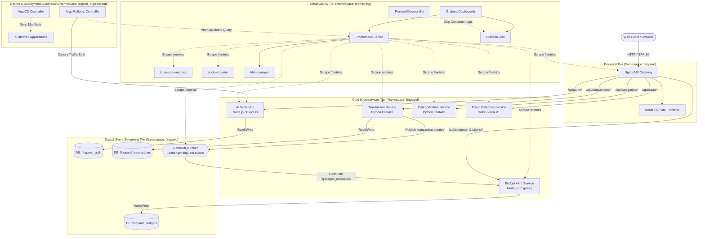

# FinGuard — System Architecture & Cloud-Native Engineering Design

**Project:** FinGuard (Microservices Personal Finance & Real-Time Fraud Platform)  
**Date:** September 28, 2026  
**Status:** **Production Design Reference**  

---

## 1. System Overview & Architectural Principles

FinGuard is architected as an event-driven, microservices-based financial management platform. The design adheres to key distributed systems and cloud-native principles:
- **Bounded Contexts & Domain-Driven Design (DDD):** Each domain (Identity, Transactions, Categories, Fraud, Budgets) is strictly isolated into its own independent microservice.
- **Database-per-Service Pattern:** Microservices never share database schemas or tables directly. In PostgreSQL, three isolated databases (`finguard_auth`, `finguard_transactions`, `finguard_budgets`) enforce data boundaries.
- **Hybrid Communication:** Low-latency validation uses synchronous REST via HTTP/1.1; decoupled financial events are broadcast asynchronously using RabbitMQ topic exchanges.
- **Zero-Trust Network Microsegmentation:** Pods communicate strictly through Kubernetes `NetworkPolicy` allowlists; unauthorized cross-tier traffic is blocked by default.
- **Declarative GitOps Infrastructure:** Cluster state is declaratively tracked in Git and continuously reconciled via ArgoCD and Kustomize.
- **Progressive Delivery with Automated Safety:** Production deployments leverage Argo Rollouts canary strategies backed by real-time Prometheus metric verification and automated rollback.

---

## 2. High-Level Architecture Diagram

---

## 3. Communication Patterns & Data Flows

### 3.1 Synchronous Ingress Flow (API Gateway)
All external requests hit `api-gateway` on port 80. The Nginx reverse proxy enforces:
- Security headers (`X-Frame-Options`, `X-Content-Type-Options`, `X-XSS-Protection`, `Referrer-Policy`).
- Route mapping:
  - `/` -> `frontend:80`
  - `/api/auth/` -> `auth-service:5001`
  - `/api/transactions/` -> `transaction-service:5002`
  - `/api/categories/` -> `categorization-service:5003`
  - `/api/fraud/` -> `fraud-detection-service:5004`
  - `/api/budgets/` & `/api/alerts/` -> `budget-alert-service:5005`
  - `/health` -> Local gateway health endpoint
  - `/stub_status` -> Nginx metrics for Prometheus

### 3.2 Synchronous Service-to-Service Flow (Transaction Creation)
When a user submits a transaction via `POST /api/transactions`:
1. `transaction-service` verifies the JWT token with `auth-service` via `GET /api/auth/me`.
2. `transaction-service` calls `categorization-service` (`POST /api/categories/categorize`) for rule-based category tagging.
3. `transaction-service` calls `fraud-detection-service` (`POST /api/fraud/evaluate`) for Isolation Forest ML scoring and heuristic risk checks.
4. `transaction-service` saves the record into `finguard_transactions.transactions`.
5. `transaction-service` asynchronously publishes `transaction.created` to RabbitMQ.
6. HTTP 201 response is returned to the client.

### 3.3 Asynchronous Event Flow (Budget Alerts)
1. `transaction-service` publishes event JSON to exchange `finguard.events` with routing key `transaction.created`.
2. Exchange routes event to queue `q.budget_evaluation` (durable, with dead-letter exchange `finguard.dlx`).
3. `budget-alert-service` consumes message, queries `finguard_budgets.budgets`, evaluates spending threshold against allowance, and records an alert in `finguard_budgets.alerts` if spend reaches 80% or 100%.

---

## 4. Kubernetes Architecture & Microsegmentation

### 4.1 Namespaces
| Namespace | Scope | Access Controls |
| :--- | :--- | :--- |
| `finguard` | Application workloads, databases, message brokers, HPAs, and Rollouts | Zero-Trust NetworkPolicies active |
| `monitoring` | Observability tools (Prometheus, Grafana, Loki, Alertmanager, exporters) | ClusterRole RBAC read-only |
| `argocd` | GitOps continuous delivery controllers and server | Cluster-admin reconciliation |
| `argo-rollouts` | Progressive canary deployment controller | Custom resource controllers |
| `kube-system` | CoreDNS, Kubernetes API, Metrics Server, storage provisioner | System infrastructure |

### 4.2 Workload Strategies & Storage Design
| Component | Workload Type | Replicas | Strategy | Persistent Storage |
| :--- | :--- | :--- | :--- | :--- |
| `postgres` | Deployment | 1 | `Recreate` | 2Gi PVC (`postgres-pvc`) on hostpath |
| `rabbitmq` | Deployment | 1 | `Recreate` | 1Gi PVC (`rabbitmq-pvc`) on hostpath |
| `prometheus` | Deployment | 1 | `Recreate` | 2Gi PVC (`prometheus-pvc`) on hostpath |
| `grafana` | Deployment | 1 | `Recreate` | 1Gi PVC (`grafana-pvc`) on hostpath |
| `auth-service` | Argo Rollout | 2 (min 2, max 6) | `Canary` | Stateless (database in postgres) |
| `transaction-service` | Deployment | 1-5 (HPA) | `RollingUpdate` | Stateless (database in postgres) |
| `categorization-service`| Deployment | 1-4 (HPA) | `RollingUpdate` | Stateless |
| `fraud-detection-service`| Deployment | 1-4 (HPA) | `RollingUpdate` | Stateless |
| `budget-alert-service` | Deployment | 1 | `RollingUpdate` | Stateless (database in postgres) |
| `frontend` | Deployment | 1 | `RollingUpdate` | Stateless (Nginx static assets) |
| `api-gateway` | Deployment | 1-4 (HPA) | `RollingUpdate` | Stateless |

*Note on `Recreate` Strategy:* Workloads with ReadWriteOnce (RWO) PVCs (`postgres`, `rabbitmq`, `prometheus`, `grafana`) use `strategy: type: Recreate` to ensure volume locks are released before new pods start, eliminating multi-attach race conditions.

---

## 5. Progressive Delivery Architecture (Argo Rollouts)

FinGuard replaces standard rolling deployments for critical identity services with **Argo Rollouts**:
- **Canary Steps:**
  - Step 1: `setWeight: 10` -> 10% canary traffic
  - Step 2: `pause: { duration: 15s }` -> evaluate `auth-service-success-rate`
  - Step 3: `setWeight: 30` -> 30% canary traffic
  - Step 4: `pause: { duration: 15s }` -> evaluate `auth-service-success-rate`
  - Step 5: `setWeight: 60` -> 60% canary traffic
  - Step 6: `pause: { duration: 15s }` -> evaluate `auth-service-success-rate`
  - Step 7: `setWeight: 100` -> 100% promotion (canary becomes new stable)
- **PromQL Verification:** Queries real-time Prometheus HTTP status code rates. If success rate falls below 95% ($< 0.95$), the Rollout controller immediately aborts the rollout, terminates canary pods, and preserves the stable revision.

---

## 6. Observability & Telemetry Architecture

1. **Metrics Collection:** Prometheus scrapes all 9 FinGuard services every 15s via Kubernetes pod discovery annotations (`prometheus.io/scrape: "true"`).
2. **Cluster Telemetry:** `kube-state-metrics` exports pod/deployment states; `node-exporter` exports host CPU, memory, and disk.
3. **Log Aggregation:** Promtail runs as a DaemonSet mounting `/var/log/pods` and streaming structured JSON logs into Loki 3.0.0.
4. **SLO Alerting:** Alertmanager evaluates 10 alert rules covering latency, 5xx errors, pod restarts, disk exhaustion, and database availability.
5. **Visualization:** Grafana automatically provisions datasources (Prometheus & Loki) and 3 purpose-built dashboards on pod creation.

---

## 7. Security Architecture

1. **Microsegmentation:** 11 declarative `NetworkPolicy` objects block unauthorized ingress and restrict egress strictly to required dependencies and CoreDNS.
2. **Zero Known Vulnerabilities:** Strict Trivy scanning in GitHub Actions CI gates (`--severity HIGH,CRITICAL`, `--exit-code 1`).
3. **Secret Isolation:** Production credentials reside exclusively in Kubernetes Secrets applied out-of-band; zero credentials committed to Git.
