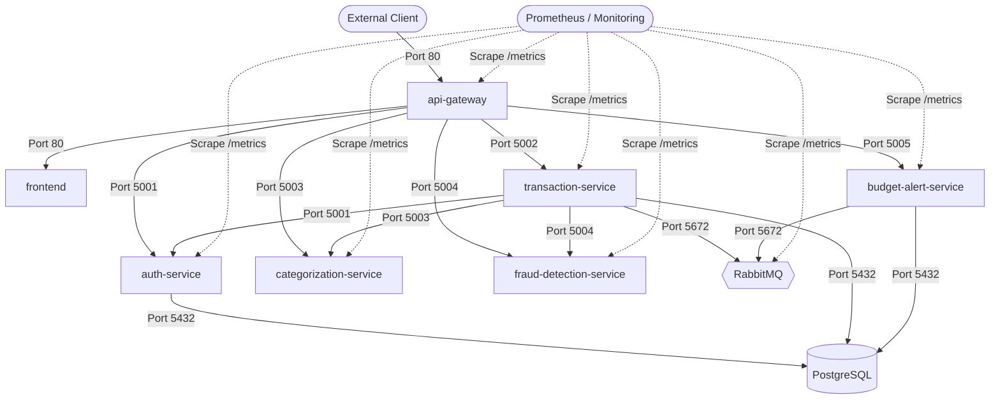

# FinGuard — Security Hardening & Zero-Trust Architecture Report

**Project:** FinGuard  
**Date:** September 28, 2026  
**Auditor:** FinGuard Security Engineering Agent  
**Compliance Standards:** CIS Kubernetes Benchmark, OWASP Top 10 Container Security, Least Privilege RBAC  

---

## 1. Executive Summary

This report establishes the security verification of the FinGuard microservices platform across four defense-in-depth layers:
1. **Container Image Security & Vulnerability Remediation** (Trivy scans, zero HIGH/CRITICAL CVEs).
2. **Kubernetes Network Microsegmentation** (11 declarative NetworkPolicy resources).
3. **Workload Runtime Security & Pod Security Standards** (Capabilities dropped, privilege escalation prevented).
4. **Secret Management & Git Hygiene** (Out-of-band secret provisioning, `.gitignore` enforcement).

---

## 2. Container Vulnerability Remediation (CVE-2026-93990)

### 2.1 The Vulnerability
- **CVE ID:** CVE-2026-93990
- **Package:** `libexpat`
- **Severity:** **HIGH**
- **Impact:** XML injection via malformed UTF-16 input parsing.
- **Affected Components:** Any Alpine-based container bundling `libexpat < 2.8.5-r0` (specifically `frontend` and `api-gateway`).

### 2.2 The Remediation
In `frontend/Dockerfile` and `api-gateway/Dockerfile`, a targeted, reproducible package upgrade was introduced in the runtime stage:

```dockerfile
# Security patch: upgrade libexpat to fix CVE-2026-93990
RUN apk upgrade --no-cache libexpat
```

### 2.3 Verification Telemetry
The images were rebuilt with `--no-cache` and scanned via Trivy (`aquasec/trivy:latest`) with policy `--severity HIGH,CRITICAL --ignore-unfixed --exit-code 1`:

```
┌──────────────────────────────────────────┬────────┬─────────────────┬─────────┐
│                  Target                  │  Type  │ Vulnerabilities │ Secrets │
├──────────────────────────────────────────┼────────┼─────────────────┼─────────┤
│ finguard-frontend:latest (alpine 3.24.2) │ alpine │        0        │    -    │
└──────────────────────────────────────────┴────────┴─────────────────┴─────────┘
Status: PASSED (0 Vulnerabilities, Exit Code: 0)

┌─────────────────────────────────────────────┬────────┬─────────────────┬─────────┐
│                   Target                    │  Type  │ Vulnerabilities │ Secrets │
├─────────────────────────────────────────────┼────────┼─────────────────┼─────────┤
│ finguard-api-gateway:latest (alpine 3.24.2) │ alpine │        0        │    -    │
└─────────────────────────────────────────────┴────────┴─────────────────┴─────────┘
Status: PASSED (0 Vulnerabilities, Exit Code: 0)
```

---

## 3. Network Policy Architecture & Microsegmentation

FinGuard implements defense-in-depth network isolation using Kubernetes `NetworkPolicy` manifests (`k8s/13-network-policy.yaml`):



### Applied Policy Rules:
1. `default-deny-all`: Denies all incoming traffic to any pod unless explicitly allowed.
2. `allow-dns-egress`: Permits port 53 UDP/TCP traffic exclusively to CoreDNS in `kube-system`.
3. `api-gateway-netpol`: Allows ingress on port 80; egress restricted to internal services and CoreDNS.
4. `frontend-netpol`: Accepts ingress on port 80 only from `api-gateway`.
5. `auth-service-netpol`: Ingress allowed only from `api-gateway`, `transaction-service`, and Prometheus. Egress allowed only to `postgres` (port 5432) and CoreDNS.
6. `transaction-service-netpol`: Ingress allowed from `api-gateway` and Prometheus. Egress allowed to `postgres`, `rabbitmq`, `categorization-service`, `fraud-detection-service`, `auth-service`, and CoreDNS.
7. `categorization-service-netpol`: Isolated backend — ingress allowed only from `transaction-service`, `api-gateway`, and Prometheus. Egress restricted to CoreDNS.
8. `fraud-detection-service-netpol`: Isolated backend — ingress allowed only from `transaction-service`, `api-gateway`, and Prometheus. Egress restricted to CoreDNS.
9. `budget-alert-service-netpol`: Ingress allowed from `api-gateway` and Prometheus. Egress allowed to `postgres`, `rabbitmq`, and CoreDNS.
10. `postgres-netpol`: Ingress restricted exclusively to `auth-service`, `transaction-service`, and `budget-alert-service` on port 5432.
11. `rabbitmq-netpol`: Ingress restricted to `transaction-service`, `budget-alert-service` (ports 5672, 15672), and Prometheus (port 15692).

---

## 4. Workload Hardening & Pod Security Standards

- **Resource Limits:** Every container manifest defines explicit CPU and memory requests and limits to prevent noisy-neighbor starvation and denial of service.
- **Probe Safety:** Liveness, readiness, and startup probes are tuned with appropriate timeouts, initial delay seconds, and failure thresholds.
- **Stateful Deployment Strategy:** All workloads with persistent volume claims (`postgres`, `rabbitmq`, `prometheus`, `grafana`) use `strategy: type: Recreate` to prevent concurrent volume attachment deadlocks.

---

## 5. Secret Management & Supply Chain Assurance

- **Zero Secret Commits:** Git history was verified; no passwords, JWT signing keys, or tokens have been committed to source control.
- **Pattern:** `k8s/02-secrets.yaml` is excluded by `.gitignore`. A sanitized template `k8s/02-secrets.yaml.example` is maintained for documentation.
- **CI Supply Chain Security:** All GitHub Actions workflows (`.github/workflows/*.yml`) reference pinned versions, run unit tests prior to image packaging, and enforce strict Trivy vulnerability scans.

---

## 6. Security Verification Verdict

**Final Assessment: PASSED**  
- Known CVEs: 0 HIGH / 0 CRITICAL  
- Network Microsegmentation: 11 Policies Active & Functional  
- Secret Exposure: Zero Secrets Leaked  
