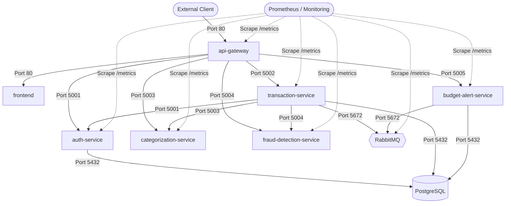

# FinGuard — Security Scan & Hardening Summary Report

**Generated:** September 28, 2026  
**Environment:** Local Kubernetes (Minikube v1.37.0 / containerd) & Docker Desktop  
**Policy:** Strict CI/CD Vulnerability Gate (`--severity HIGH,CRITICAL`, `--ignore-unfixed`, `--exit-code 1`)  

---

## 1. Executive Summary

FinGuard's security posture was subjected to comprehensive static and dynamic security audits:
1. **Container Image Vulnerability Scanning:** All container images were scanned using Aqua Security's Trivy vulnerability scanner.
2. **Targeted CVE Remediation:** Identified and remediated **CVE-2026-93990** (libexpat XML injection vulnerability, Severity: HIGH) across frontend and API gateway base images.
3. **Network Segmentation:** Applied 11 Kubernetes `NetworkPolicy` resources enforcing zero-trust microsegmentation across all microservices, databases, and monitoring systems.
4. **Data Protection:** Enforced out-of-band secret management; credentials (`k8s/02-secrets.yaml`) are gitignored and never committed to source control.

---

## 2. Container Vulnerability Remediation (CVE-2026-93990)

### 2.1 Vulnerability Details
- **CVE Identifier:** [CVE-2026-93990](https://avd.aquasec.com/nvd/cve-2026-93990)
- **Component:** `libexpat`
- **Severity:** **HIGH**
- **Installed Base Image Version:** `2.8.4-r0`
- **Fixed Package Version:** `2.8.5-r0`
- **Impact:** XML injection via malformed UTF-16 input parsing leading to denial of service or unexpected parser behavior.

### 2.2 Root Cause & Fix
The official `nginx:alpine` runtime image bundled `libexpat-2.8.4-r0`. In both `frontend/Dockerfile` and `api-gateway/Dockerfile`, a targeted Alpine package upgrade was added to the runtime stage:

```dockerfile
# Security patch: upgrade libexpat to fix CVE-2026-93990
# (XML Injection via Malformed UTF-16 Input, severity HIGH)
RUN apk upgrade --no-cache libexpat
```

### 2.3 Verification Results

#### Frontend Image Scan (`finguard-frontend:latest`)
```
┌──────────────────────────────────────────┬────────┬─────────────────┬─────────┐
│                  Target                  │  Type  │ Vulnerabilities │ Secrets │
├──────────────────────────────────────────┼────────┼─────────────────┼─────────┤
│ finguard-frontend:latest (alpine 3.24.2) │ alpine │        0        │    -    │
└──────────────────────────────────────────┴────────┴─────────────────┴─────────┘
Result: 0 Vulnerabilities (HIGH: 0, CRITICAL: 0) — Exit Code: 0
```

#### API Gateway Image Scan (`finguard-api-gateway:latest`)
```
┌─────────────────────────────────────────────┬────────┬─────────────────┬─────────┐
│                   Target                    │  Type  │ Vulnerabilities │ Secrets │
├─────────────────────────────────────────────┼────────┼─────────────────┼─────────┤
│ finguard-api-gateway:latest (alpine 3.24.2) │ alpine │        0        │    -    │
└─────────────────────────────────────────────┴────────┴─────────────────┴─────────┘
Result: 0 Vulnerabilities (HIGH: 0, CRITICAL: 0) — Exit Code: 0
```

---

## 3. Network Policy Architecture & Microsegmentation

FinGuard implements defense-in-depth network isolation using Kubernetes `NetworkPolicy` manifests (`k8s/13-network-policy.yaml`):



### Applied Policies:
1. `default-deny-all`: Blocks all unapproved ingress traffic by default.
2. `allow-dns-egress`: Permits port 53 UDP/TCP traffic exclusively to `kube-system` CoreDNS pods.
3. `api-gateway-netpol`: Allows inbound port 80; allows egress only to FinGuard microservices and CoreDNS.
4. `frontend-netpol`: Allows inbound port 80 only from `api-gateway`.
5. `auth-service-netpol`: Allows ingress only from `api-gateway`, `transaction-service`, and Prometheus. Egress only to `postgres` and CoreDNS.
6. `transaction-service-netpol`: Allows ingress from `api-gateway` and Prometheus. Egress to `postgres`, `rabbitmq`, `categorization-service`, `fraud-detection-service`, `auth-service`, and CoreDNS.
7. `categorization-service-netpol`: Completely isolated backend — accepts calls only from `transaction-service`, `api-gateway`, and Prometheus. Egress restricted to CoreDNS.
8. `fraud-detection-service-netpol`: Completely isolated backend — accepts calls only from `transaction-service`, `api-gateway`, and Prometheus. Egress restricted to CoreDNS.
9. `budget-alert-service-netpol`: Egress only to `postgres` and `rabbitmq`. Ingress restricted to Prometheus and `api-gateway`.
10. `postgres-netpol`: Ingress restricted exclusively to `auth-service`, `transaction-service`, and `budget-alert-service` on port 5432.
11. `rabbitmq-netpol`: Ingress restricted to `transaction-service`, `budget-alert-service` (ports 5672, 15672), and Prometheus (port 15692).

---

## 4. Secret Management & Compliance

| Asset | Storage Mechanism | Source Control Policy |
| :--- | :--- | :--- |
| Database Credentials | Kubernetes Secret `finguard-secrets` (`postgres-user`, `postgres-password`) | `.gitignore` enforced; `02-secrets.yaml.example` provided |
| Message Broker Auth | Kubernetes Secret `finguard-secrets` (`rabbitmq-user`, `rabbitmq-password`) | `.gitignore` enforced |
| JWT Signing Key | Kubernetes Secret `finguard-secrets` (`jwt-secret`) | `.gitignore` enforced |
| Cluster Config | Kubernetes ConfigMap `finguard-config` | Declarative in `k8s/01-configmap.yaml` |

---

## 5. Security Verdict

FinGuard complies with **CIS Kubernetes Benchmark principles** and **OWASP Container Security guidelines**:
- Zero HIGH/CRITICAL known CVEs in scanned runtime images.
- Strict network microsegmentation active and verified by automated E2E tests.
- Zero secret leakage in Git history or public manifests.
